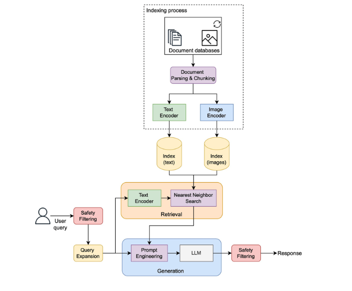

# IPCC AR6 RAG

A small, local Retrieval-Augmented Generation system over the IPCC Sixth Assessment
Report (AR6). Ask climate-science questions and get answers grounded *only* in the
AR6 text, with section-level citations.

## Architecture

```
PDFs ──► load + section-tag ──► chunk ──► embed (Ollama) ──► ChromaDB
                                                                │
                          question ──► vector search (top-K) ◄──┘
                                            │
                                            ▼
                              cross-encoder rerank (top-k)
                                            │
                                            ▼
                                grounded LLM answer + citations
```

Two-stage retrieval — a fast vector search pulls a wide candidate set, then a
cross-encoder reranker re-scores each candidate against the question to keep only
the most relevant passages. This is more accurate than vector search alone (which
optimizes for semantic similarity, not answer relevance) without paying the
cross-encoder cost on the whole corpus.

## Stack

- **LangChain** — document loaders, splitter, retrieval glue
- **Ollama** — local inference for both embeddings and generation
- **ChromaDB** — persistent on-disk vector store
- **Hugging Face cross-encoder** (`bge-reranker-base`) — reranker, runs on CPU
- **Streamlit** — UI

## Setup

### 1. Install Ollama

Download from [ollama.com](https://ollama.com) and install. On Apple Silicon it
runs natively via Metal.

### 2. Pull the models

```bash
ollama pull nomic-embed-text
ollama pull llama3.1:8b
```

### 3. Install Python dependencies

```bash
python -m venv .venv && source .venv/bin/activate
pip install -r requirements.txt
```

### 5. Ingest the PDFs

```bash
python ingest.py
```

This loads each PDF, tags chunks with `(report, section, page)` metadata, embeds
them with `nomic-embed-text`, and persists everything to `chroma_db/`. Run once;
re-run only if you change chunking parameters or swap embedding models.

### 6. Run the app

```bash
streamlit run app.py
```

Or run the smoke test:

```bash
python eval.py
```

## Files

| File | Purpose |
|---|---|
| [`config.py`](config.py) | Single source of truth for every tunable (paths, model names, chunk size, retrieval counts) |
| [`ingest.py`](ingest.py) | PDF → tagged chunks → ChromaDB |
| [`rag.py`](rag.py) | Two-stage retrieval + grounded answer chain |
| [`app.py`](app.py) | Streamlit UI |
| [`eval.py`](eval.py) | ~5-question smoke test (answerable + unanswerable) |

